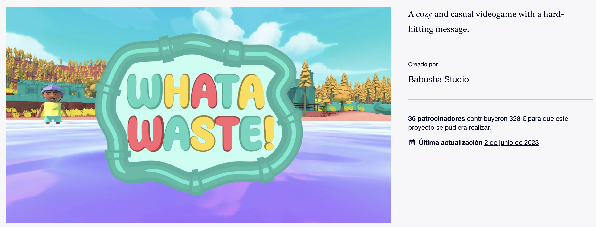
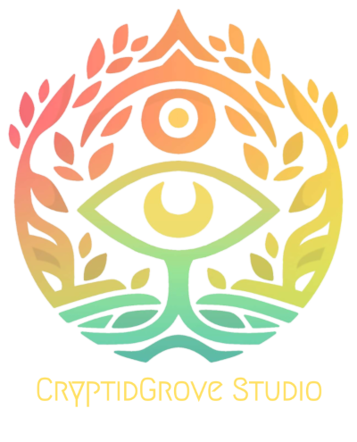

---

## ¿Quiénes somos?

---

## Metodología

A hacer videojuegos se aprende haciendo videojuegos <!-- .element: class="fragment"-->

Formación inicial básica de un mes <!-- .element: class="fragment"-->

Creación de un estudio indie <!-- .element: class="fragment"-->

Game Jams continuadas <!-- .element: class="fragment"-->

Noviembre: GameOff

Diciembre: Winter Visual Novel <!-- .element: class="fragment"-->

Enero-febrero: Boss Rush + Málaga Jam <!-- .element: class="fragment"-->

Marzo-mayo: Proyecto final <!-- .element: class="fragment"-->

Coordinación entre todos los módulos (excepto RV y RA)

Evaluación personalizada <!-- .element: class="fragment"-->
---

## ¿Qué proyectos se han realizado cursos anteriores?

## Babusha Studio

## Baker´s Bizarre Adventure
### GameOff 2022

## Metal Junk Fighter
### Boss Rush 2023

## Simulador de equipos en VR
### Mención Dualiza

## What a Waste!

## Cryptidgrove Studio

## Kiwi´s Adventure - Dungeon Slider
### GameOff 2023

## Marketing: Shadow of the Colosito

---

<!-- .slide: data-background-video="assets/searching.mp4" data-background-opacity="0.6" data-background-video-loop data-background-video-muted-->

## ¿Dudas?
